# 🥗 ChunDiet - AI-Powered Nutrition Tracking & Planning

<div align="center">


**Your Personal AI Nutritionist Named Chun** 🤖

[](https://opensource.org/licenses/MIT)
[](https://www.python.org/downloads/)
[](https://flask.palletsprojects.com/)
[](https://www.docker.com/)
[](https://ai.google.dev/)
[](https://github.com/Chungus1310/ChunDiet/releases/download/windows_releaseV0/ChunDiet.exe)

*Transform your relationship with food through intelligent nutrition analysis and personalized recommendations*

[🚀 Quick Start](#quick-start) • [📱 Features](#features) • [🛠️ Installation](#installation) • [📖 API Docs](#api-documentation)

</div>

---

## ✨ What is ChunDiet?

ChunDiet is your **intelligent nutrition companion** that leverages Google's Gemini AI to analyze your meals, track nutritional intake, and provide personalized recommendations. Meet **Chun**, your AI nutritionist with over 15 years of virtual experience in food analysis and dietary guidance!

### 🎯 Why ChunDiet?

- **🧠 AI-Powered Analysis**: Just describe your meal in natural language - "I had grilled chicken with quinoa and vegetables"
- **📊 Comprehensive Tracking**: Detailed breakdowns of calories, macronutrients, vitamins, and minerals  
- **🎯 Personalized Plans**: Get custom recommendations based on your goals, activity level, and dietary preferences
- **📱 Modern Interface**: Beautiful, responsive design that works seamlessly on all devices
- **🔄 Smart Insights**: Learn from your eating patterns with intelligent trend analysis

---

## 🖼️ Demo

<details>
<summary>📱 Dashboard Overview</summary>


*Clean, intuitive dashboard for meal logging and daily progress tracking*

</details>

<details>
<summary>🔍 AI Analysis Features</summary>

<table>
<tr>
<td width="50%">


*Detailed nutritional breakdown*

</td>
<td width="50%">


*Vitamin and mineral analysis*

</td>
</tr>
<tr>
<td width="50%">


*Smart recommendations*

</td>
<td width="50%">


*Personalized meal planning*

</td>
</tr>
</table>

</details>

<details>
<summary>⚙️ Settings & Customization</summary>


*Comprehensive settings for API configuration, goals, and preferences*

</details>

---

## 🚀 Quick Start

> **Want to try ChunDiet right now?** Choose your preferred method:

### 🪟 Option 1: Windows Executable (Easiest!)
```bash
# Download and run - no installation needed!
1. Download: https://github.com/Chungus1310/ChunDiet/releases/download/windows_releaseV0/ChunDiet.exe
2. Double-click ChunDiet.exe
3. Enter your Gemini API key in settings
4. Browser opens automatically at http://localhost:5000 🎉
# Data persists in %appdata%/ChunDiet
```

### 🐳 Option 2: Docker (Cross-platform)
```bash
# Clone and run with Docker
git clone https://github.com/Chungus1310/ChunDiet.git
cd ChunDiet
docker build -t chundiet .
docker run -p 5000:5000 -e GEMINI_API_KEY="your-api-key-here" chundiet
# Visit http://localhost:5000 🎉
```

### 🐍 Option 3: Local Python Setup
```bash
# Traditional setup
git clone https://github.com/Chungus1310/ChunDiet.git
cd ChunDiet
pip install -r backend/requirements.txt
export GEMINI_API_KEY="your-api-key-here"
python backend/app.py
# Visit http://localhost:5000 🎉
```

**That's it!** Start describing your meals and watch Chun work its magic! ✨

---

## 📱 Features

<table>
<tr>
<td width="50%">

### 🍽️ **Smart Meal Analysis**
- Natural language meal descriptions
- Comprehensive nutritional breakdown
- Vitamin & mineral analysis
- Portion size recommendations
- Cooking method considerations

### 🎯 **Personalized Planning**
- Custom daily nutrition goals
- Activity level adjustments
- Dietary preference support
- Smart meal suggestions
- Progress tracking & insights

</td>
<td width="50%">

### 📊 **Advanced Analytics**
- Historical nutrition trends
- Daily/weekly summaries
- Nutrient deficiency alerts
- Goal achievement tracking
- Pattern recognition

### 🛠️ **Modern Experience**
- Responsive mobile design
- Dark/light theme support
- Offline-ready PWA features
- Touch-friendly interactions
- Real-time notifications

</td>
</tr>
</table>

---

## 🏗️ Architecture

ChunDiet is built with a **modern, scalable architecture**:

```mermaid
graph TB
    A[🌐 Frontend - HTML/CSS/JS] --> B[🔄 Flask Backend]
    B --> C[🤖 Gemini AI Service]
    B --> D[💾 SQLite Database]
    B --> E[📊 Nutrition Analysis]
    
    C --> F[🧠 Meal Analysis]
    C --> G[💡 Recommendations]
    
    D --> H[👤 User Profiles]
    D --> I[🍽️ Meal History]
    D --> J[🎯 Goals & Settings]
```



### 🧩 Core Components

| Component | Technology | Purpose |
|-----------|------------|---------|
| **Frontend** | Vanilla JS, CSS3, HTML5 | Responsive UI with animations |
| **Backend** | Flask, Python 3.8+ | REST API and business logic |
| **AI Engine** | Google Gemini AI | Nutrition analysis & recommendations |
| **Database** | SQLite | User data and meal history |
| **Deployment** | Docker, Heroku-ready | Production deployment |

---

## 🛠️ Installation

### 📋 Prerequisites

- **Windows 10+** 🪟 (for executable) or **Python 3.8+** 🐍 or **Docker** 🐳
- **Gemini API Key** 🔑 ([Get yours free](https://aistudio.google.com/apikey))
- **Modern Web Browser** 🌐

### 🔧 Development Setup Options

<details>
<summary>🪟 Windows Executable (Recommended for Windows Users)</summary>

1. **Download the Executable**
   - Visit: [ChunDiet Windows Release](https://github.com/Chungus1310/ChunDiet/releases/download/windows_releaseV0/ChunDiet.exe)
   - Download `ChunDiet.exe` (no installation required!)

2. **Run the Application**
   - Double-click `ChunDiet.exe`
   - A console window will open showing server logs
   - Your browser will automatically open to `http://localhost:5000`

3. **Setup API Key**
   - Enter your Gemini API key in the settings when prompted
   - Your data is automatically saved to `%appdata%/ChunDiet`

4. **Using the Application**
   - Keep the console window open (server logs display here)
   - Closing the console window will stop the application
   - Your nutrition data persists between sessions

> **Note**: The executable includes the complete Flask server and opens your browser automatically. All backend activity is logged in the console for transparency.

</details>

<details>
<summary>🐳 Docker Setup</summary>

1. **Clone the Repository**
   ```bash
   git clone https://github.com/Chungus1310/ChunDiet.git
   cd ChunDiet
   ```

2. **Build Docker Image**
   ```bash
   docker build -t chundiet .
   ```

3. **Run Container**
   ```bash
   # With environment variable
   docker run -p 5000:5000 -e GEMINI_API_KEY="your-api-key-here" chundiet
   
   # Or with .env file
   docker run -p 5000:5000 --env-file .env chundiet
   ```

4. **Access Application**
   Navigate to `http://localhost:5000` 🎉

</details>

<details>
<summary>🐍 Local Python Setup</summary>

1. **Clone the Repository**
   ```bash
   git clone https://github.com/Chungus1310/ChunDiet.git
   cd ChunDiet
   ```

2. **Create Virtual Environment**
   ```bash
   python -m venv venv
   
   # Windows
   venv\Scripts\activate
   
   # macOS/Linux
   source venv/bin/activate
   ```

3. **Install Dependencies**
   ```bash
   pip install -r backend/requirements.txt
   ```

4. **Environment Configuration**
   ```bash
   # Create .env file (optional)
   echo "GEMINI_API_KEY=your-api-key-here" > .env
   
   # Or export directly
   export GEMINI_API_KEY="your-api-key-here"
   ```

5. **Initialize Database**
   ```bash
   python -c "from backend.models import init_db; init_db()"
   ```

6. **Launch Application**
   ```bash
   python backend/app.py
   ```

7. **Open Browser**
   Navigate to `http://localhost:5000` and start your nutrition journey! 🎉

</details>

<details>
<summary>🏗️ Building Windows Executable (For Developers)</summary>

If you want to build the executable yourself:

1. **Setup Development Environment**
   ```bash
   git clone https://github.com/Chungus1310/ChunDiet.git
   cd ChunDiet
   pip install -r backend/requirements.txt
   pip install pyinstaller
   ```

2. **Build Executable**
   ```bash
   # Use the provided build script
   build.bat
   
   # Or manually with PyInstaller
   pyinstaller --onefile --add-data "frontend;frontend" --add-data "backend;backend" run.py
   ```

3. **Find Your Executable**
   The built executable will be in the `dist/` directory.

</details>

### 🚀 Production Deployment

<details>
<summary>Deploy with Docker</summary>

```bash
# Build for production
docker build -t chundiet:production .

# Run with production settings
docker run -d \
  --name chundiet-app \
  -p 80:5000 \
  -e GEMINI_API_KEY=your-api-key-here \
  -e FLASK_ENV=production \
  --restart unless-stopped \
  chundiet:production
```

</details>

<details>
<summary>Deploy to Heroku</summary>

```bash
# Install Heroku CLI
heroku create your-chundiet-app

# Set environment variables
heroku config:set GEMINI_API_KEY=your-api-key-here

# Deploy
git push heroku main

# Open your app
heroku open
```

</details>

---

## 📖 API Documentation

### 🔗 Core Endpoints

| Method | Endpoint | Description |
|--------|----------|-------------|
| `POST` | `/api/analyze-meal` | Analyze meal description with AI |
| `GET` | `/api/daily-summary/<date>` | Get nutrition summary for date |
| `GET` | `/api/history` | Retrieve nutrition history |
| `POST` | `/api/ai-recommendations` | Generate personalized recommendations |
| `GET/POST` | `/api/user/profile` | Manage user profile |
| `GET/POST` | `/api/settings` | Configure app settings |

### 📝 Example Usage

<details>
<summary>Analyze a Meal</summary>

```javascript
// Analyze meal nutrition
const response = await fetch('/api/analyze-meal', {
  method: 'POST',
  headers: { 'Content-Type': 'application/json' },
  body: JSON.stringify({
    description: "Grilled salmon with quinoa and steamed broccoli",
    time: "2024-01-15T18:30:00",
    user_id: 1
  })
});

const result = await response.json();
console.log(result.nutritional_values);
```

</details>

<details>
<summary>Get AI Recommendations</summary>

```javascript
// Get personalized recommendations
const recommendations = await fetch('/api/ai-recommendations', {
  method: 'POST',
  headers: { 'Content-Type': 'application/json' },
  body: JSON.stringify({ user_id: 1 })
});

const plan = await recommendations.json();
console.log(plan.food_recommendations);
```

</details>

---

## 🎨 Customization

### 🎯 Configure Your Goals

1. **Set Personal Profile**
   - Age, weight, activity level
   - Dietary preferences
   - Health objectives

2. **Customize Nutrition Targets**
   - Daily calorie goals
   - Macro ratios (protein/carbs/fat)
   - Specific nutrient targets

3. **AI Behavior Tuning**
   - Temperature settings for creativity
   - Response style preferences
   - Analysis depth levels

### 🎨 Theme Customization

ChunDiet supports **light/dark themes** and responsive design out of the box. Want to customize further?

```css
/* Override CSS variables in assets/styles.css */
:root {
  --primary-color: #your-color;
  --secondary-color: #your-accent;
  --background-gradient: your-gradient;
}
```

---

## 🤝 Contributing

We'd love your help making ChunDiet even better! Here's how you can contribute:

### 🎯 Ways to Contribute

- 🐛 **Bug Reports**: Found an issue? [Open an issue](https://github.com/Chungus1310/ChunDiet/issues)
- 💡 **Feature Requests**: Have ideas? We want to hear them!
- 🔧 **Code Contributions**: Submit PRs for improvements
- 📖 **Documentation**: Help improve our docs
- 🎨 **Design**: UI/UX improvements are always welcome

### 📝 Development Workflow

1. **Fork** the repository
2. **Create** a feature branch (`git checkout -b feature/amazing-feature`)
3. **Commit** your changes (`git commit -m 'Add amazing feature'`)
4. **Push** to branch (`git push origin feature/amazing-feature`)
5. **Open** a Pull Request


---

## 🆘 Support & FAQ

### ❓ Common Questions

<details>
<summary><strong>Q: Do I need a paid Gemini API key?</strong></summary>

**A:** Nope! Google's Gemini AI offers a generous free tier that's perfect for personal use. You can analyze hundreds of meals per month without any cost.

</details>

<details>
<summary><strong>Q: Can I use ChunDiet offline?</strong></summary>

**A:** The app has offline-ready features for viewing your data, but meal analysis requires an internet connection to communicate with the AI service.

</details>

<details>
<summary><strong>Q: How accurate is the nutrition analysis?</strong></summary>

**A:** ChunDiet uses advanced AI trained on comprehensive nutrition databases. While very accurate, it's designed for general guidance, not medical advice. Always consult healthcare professionals for specific dietary needs.

</details>

<details>
<summary><strong>Q: Can I export my data?</strong></summary>

**A:** Yes! ChunDiet stores all your data locally in SQLite, making it easy to export and backup your nutrition history.

</details>

<details>
<summary><strong>Q: Should I use the Windows executable or other setup methods?</strong></summary>

**A:** The Windows executable is the easiest option for Windows users - no installation required! Use Docker for cross-platform deployment or Python setup if you want to modify the code.

</details>

<details>
<summary><strong>Q: Where is my data stored when using the Windows executable?</strong></summary>

**A:** Your nutrition data is automatically saved to `%appdata%/ChunDiet` on Windows, ensuring it persists between sessions and updates.

</details>

### 🐛 Need Help?

- 📧 **Email**: [Create an issue](https://github.com/Chungus1310/ChunDiet/issues) for fastest response
- 💬 **Discussions**: Use GitHub Discussions for feature requests
- 📱 **Mobile Issues**: Include device/browser info in bug reports

---

## 📄 License

ChunDiet is **open source** and available under the [MIT License](LICENSE).

```
MIT License - Feel free to use, modify, and distribute!
Perfect for personal projects, learning, and commercial use.
```


---

<div align="center">

### 🚀 Ready to transform your nutrition journey?

**[⭐ Star this repo](https://github.com/Chungus1310/ChunDiet)** if ChunDiet helped you eat healthier!

Made with ❤️ by [**Chun**](https://github.com/Chungus1310)

*"Nutrition is not about restriction, it's about nourishment and making informed choices."*

---

**[🏠 Home](https://github.com/Chungus1310/ChunDiet)** •  **[🛠️ Install](#installation)** • **[🤝 Contribute](#contributing)** • **[📧 Support](#support--faq)**

[](https://github.com/Chungus1310)
[](https://github.com/Chungus1310/ChunDiet/stargazers)

</div>
